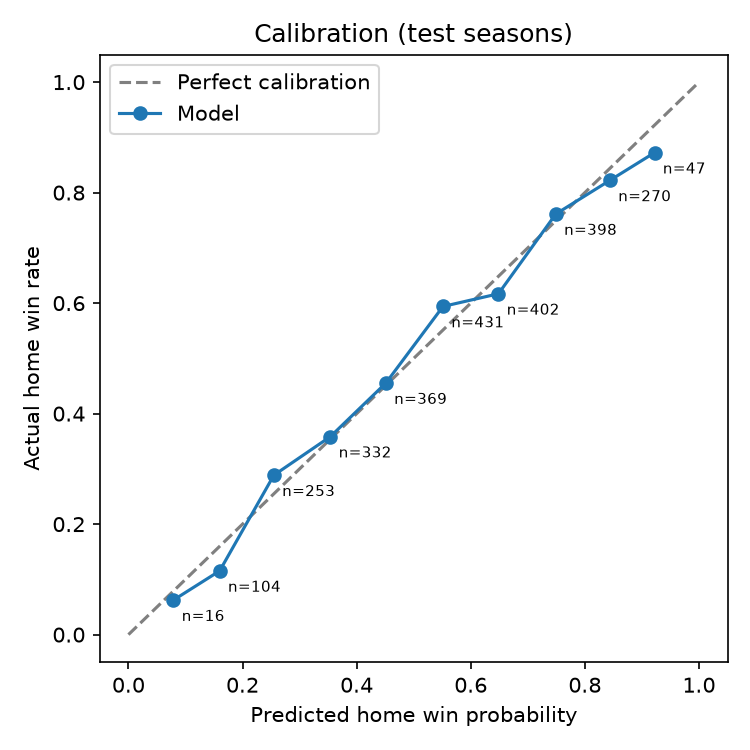

# NBA Win Probability Model

A recency-weighted rating model that turns recent point margins into win probabilities for
NBA games. It's evaluated with a walk-forward backtest (no future data ever leaks in) and
tracked live, with every prediction committed to GitHub before tip-off, during the 2026-27 season.

**Key results (2024-25 and 2025-26 seasons, 2,622 games the model never saw during tuning):**
- Picked the winner in **67.5%** of games, vs. 55.0% for "always pick the home team" and 65.3% for "pick the better record"
- Log loss **0.606** vs. 0.688 for the home-team baseline and 0.693 for a coin flip
- Live 2026-27 record: **[..]** (updated monthly)

## Question
Can a simple rating built from recent point margins predict NBA winners better than the
rules a casual fan would use, and are its probabilities *honest*? When it says 70%, does
the favorite actually win about 70% of the time?

## Data
Kaggle: *Historical NBA Data and Player Box Scores* (TeamStatistics.csv), 2022-23 through 2025-26
regular season and playoffs (5,248 games).
Each game appears once per team in the raw file, so the loader keeps one row per game (the home
team's side) and builds full team names so the Lakers and Clippers stay separate.
The data isn't stored in this repo; download it into `data/`.

## Method
1. **Team rating** = weighted average point margin, where a game from *w* weeks ago gets weight `decay^w`.
   Recent games count more because rosters, injuries, and form change during a season.
2. **Strength of schedule (optional):** each margin is adjusted by the opponent's rating, so a
   close loss to a top team counts more than a close win over a weak one.
3. **Win probability:** `P(home wins) = 1 / (1 + e^-(a * gap + b))`, where `gap` = home rating - away rating.
   Logistic regression learns `a` (how much each point of rating gap matters) and `b` (home-court edge).

## Why the test is honest
- **Walk-forward:** to predict a game, the model only uses games played *before* that day.
- **Separate tuning and test seasons:** decay, strength of schedule, `a`, and `b` are all chosen
  using 2023-24 only. The reported results come from 2024-25 and 2025-26, which the model never saw while being tuned.
- **Baselines:** the model is compared against simple rules, not just against random guessing.
- **Live tracking:** 2026-27 predictions are committed before games start, so the timestamps prove they weren't made after the fact.

## Results (test seasons 2024-25 and 2025-26, 2,622 games)
| Method                 | Accuracy | Log loss | Brier |
|------------------------|----------|----------|-------|
| **Model**              | **0.675**| **0.606**|**0.209**|
| Always pick home team  | 0.550    | 0.688    | 0.248 |
| Better record so far   | 0.653    | -        | -     |
| Coin flip              | 0.500    | 0.693    | 0.250 |

Best settings (chosen on 2023-24): decay = 0.95 per week (a game's weight halves about every 13.5 weeks),
strength of schedule = on, learned home-court edge = 1.76 points.

**Tuning (2023-24 log loss, lower is better):**
| Decay | 0.80 | 0.85 | 0.90 | 0.92 | 0.95 | 0.98 | 1.00 (no recency) |
|-------|------|------|------|------|------|------|-------------------|
| Without SoS | 0.6275 | 0.6242 | 0.6177 | 0.6143 | 0.6105 | 0.6115 | 0.6170 |
| With SoS    | 0.6210 | 0.6181 | 0.6141 | 0.6120 | **0.6095** | 0.6110 | 0.6168 |

**Calibration:** predictions grouped into 10% buckets, compared with how often the home team actually won.
Dots near the dashed line mean the probabilities can be trusted. For example, in games the model
gave the home team about 75%, the home team won 76.1% of the time (398 games).



## What I learned
- Receny helps, but only moderately
- Strength of schedule gave a small, consistent improvement
- Home-court edge is smaller than its histroical reputation
- The model beats "better record" by about 2 percent
- Probabilites are well calibrated in the middle range

## Limitations
- Ignores injuries, rest days, and trades, so it reacts to them only after they show up in results.
- Blowouts count fully even when starters sat out the fourth quarter.
- Early-season ratings lean on last season's games.

## Next steps
- Cap blowout margins and test whether that improves log loss
- Add rest days / back-to-backs as a second feature
- Compare against betting-market probabilities

## Live 2026-27 season tracking
Weekly picks are committed before tip-off in [`predictions/log.csv`](predictions/log.csv).
Running record: [update monthly]

## Project structure
```
src/data.py       load Kaggle data -> one row per game
src/model.py      recency-weighted ratings, strength of schedule, win probability
src/backtest.py   tuning, walk-forward test, baselines, calibration chart
src/predict.py    live picks and scoring for the current season
results/          metrics, tuning table, calibration chart
predictions/      live 2026-27 picks
```

## How to run
```
pip install -r requirements.txt
python src/backtest.py --tune 2024 --test 2025 2026
python src/predict.py picks     # before games: reads data/upcoming.csv
python src/predict.py score     # after games: running accuracy
```

*Built by Aarav Sandip.*